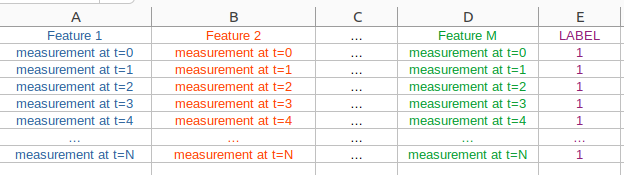

# LSTM_NeuralNetwork
A full LSTM code I used on one of my projects

The source code is LSTM implementation using Google Colab. I made it such that all you need to do is link your Google Drive directory containing your data. This network is made for binary classification. 
Your data needs to be a CSV file of individual samples (measurements) such that columns are features with the last column being a label, if needed u can adapt to multi-variable classification. When loading into pandas data frame I used header=None, but if you name your columns then you need to adjust this so pandas load your data correctly.
 
Format data like this:  

  

